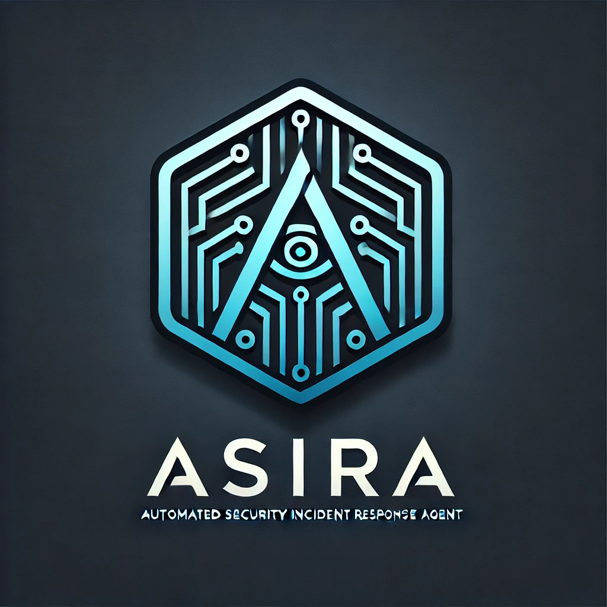

# ASIRA - Automated Security Incident Response Agent



*Version: 1.0.0*  
*Last updated: 2025-03-15 12:38:13*  
*Author: Mritunjay-mj*

> Intelligent security incident detection and automated response for enterprise environments

## Overview

ASIRA is an advanced security platform that combines anomaly detection and automated incident response to help security teams identify and mitigate threats faster. By leveraging machine learning techniques and predefined response playbooks, ASIRA reduces the time from detection to containment, minimizing the impact of security incidents.

## Features

- **Anomaly Detection**: Multi-model machine learning approach to identify security anomalies
  - Statistical analysis (Z-scores, MAD)
  - Isolation Forest algorithm
  - Deep learning with autoencoders
  - Feature importance explanation

- **Automated Response**: Orchestrate security actions through predefined playbooks
  - Account lockdown and identity protection
  - Malware containment and remediation
  - Network segment isolation
  - Custom playbook creation
  
- **Incident Management**: Complete incident lifecycle tracking
  - Incident creation from detections
  - Status tracking and assignments
  - Integration with existing SOC workflows
  - Evidence collection and documentation

- **Interactive Dashboard**: Real-time security posture visualization
  - Incident overview and metrics
  - Detection results and trends
  - System health monitoring
  - Response action tracking

- **API Integration**: Comprehensive REST API for integration with other security tools
  - Authentication and access control
  - Incident and detection endpoints
  - Playbook execution
  - Dashboard metrics

## System Requirements

### Minimum Requirements
- Python 3.8+
- PostgreSQL 12+
- 4 CPU cores
- 8GB RAM
- 100GB storage

### Recommended Requirements
- Python 3.10+
- PostgreSQL 14+
- 8+ CPU cores
- 16GB+ RAM
- 500GB+ SSD storage
- Redis (for caching)
- Elasticsearch (for log storage and searching)

## Installation

### Production Installation

Use the provided installation script to deploy ASIRA in a production environment:

```bash
# Download the installation script
curl -O https://github.com/mritunjay-cybersec/ASIRA/raw/main/scripts/install.sh

# Make the script executable
chmod +x install.sh

# Run the installation script with root privileges
sudo ./install.sh
```

### Running the Application

#### Using Docker Compose

To run the application using Docker Compose, follow these steps:

1. Ensure Docker and Docker Compose are installed on your system.
2. Navigate to the project directory.
3. Run the following command to start the services:

```bash
docker-compose up
```

This will start the `api`, `postgres`, `elasticsearch`, `redis`, `rabbitmq`, and `dashboard` services.

#### Using Uvicorn

To run the application using `uvicorn`, use the following command:

```bash
uvicorn src.main:app --host 0.0.0.0 --port 8000
```

### Development

#### Directory Structure

```
├── src/                   # Source code
│   ├── api/               # API module
│   ├── detection/         # Detection engine
│   ├── response/          # Response orchestration
│   ├── dashboard/         # Web dashboard
│   └── common/            # Shared utilities
├── playbooks/             # Playbook definitions
├── tests/                 # Test cases
├── docs/                  # Documentation
├── scripts/               # Installation and utility scripts
└── requirements.txt       # Python dependencies
```

#### Running Tests

```bash
# Run all tests
python -m pytest

# Run tests with coverage
python -m pytest --cov=src tests/

# Run specific test file
python -m pytest tests/test_detection.py
```

### API Documentation

For comprehensive API documentation, see [API Documentation](docs/api.md).

### Contributing

We welcome contributions to ASIRA! Please follow these guidelines:

1. Fork the repository
2. Create a feature branch
3. Add your changes
4. Run tests to ensure functionality
5. Submit a pull request

For more details, see our [Contributing Guidelines](CONTRIBUTING.md).

### Security

If you discover a security vulnerability in ASIRA, please send an email to [iamrahul823@gmail.com](mailto:iamrahul823@gmail.com). All security vulnerabilities will be promptly addressed.

### Acknowledgments

- Thanks to all contributors who have helped build ASIRA
- Special thanks to the open-source projects that made this possible
- Inspired by real-world security incident response challenges

For additional support, please open an issue on GitHub or contact [support@example.com](mailto:support@example.com).
